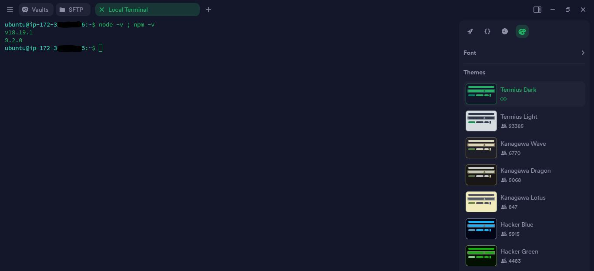
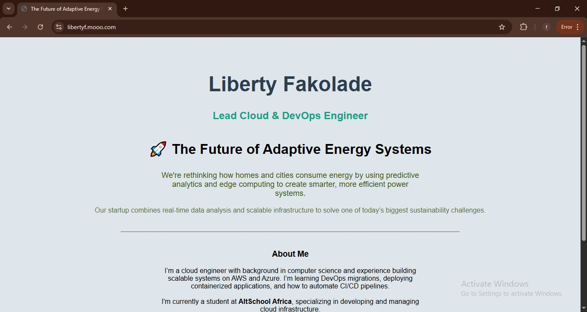
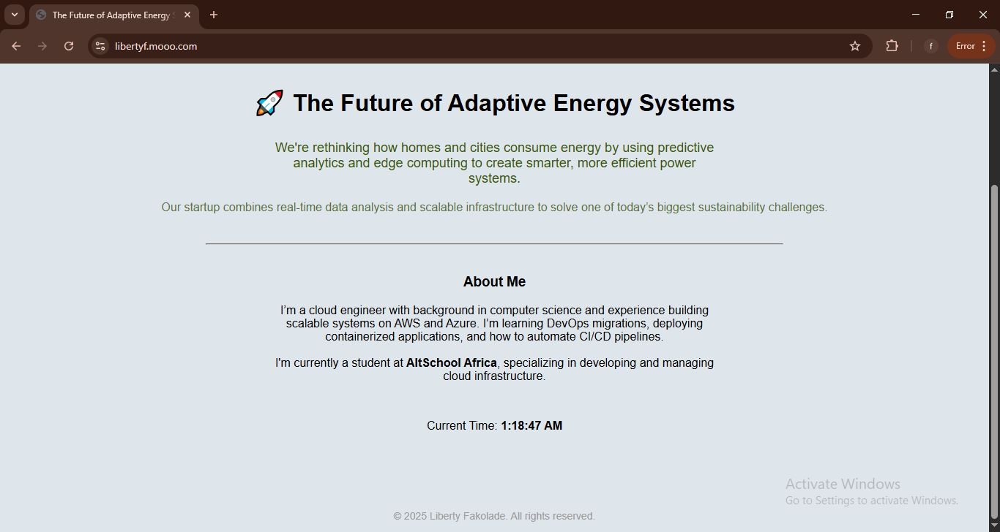
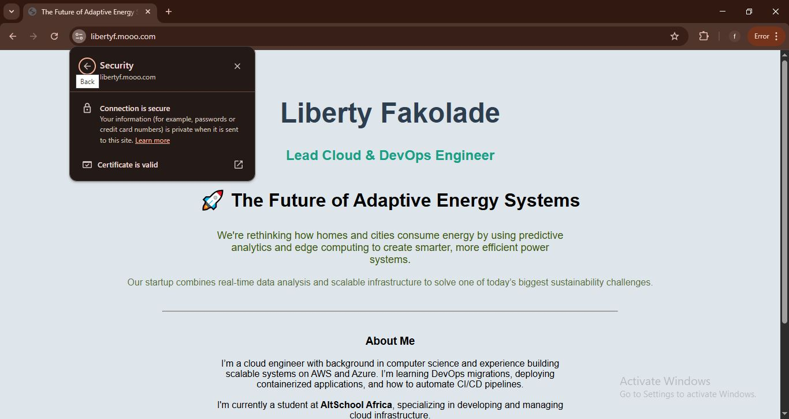

<details>
<summary><strong> 📘 Table of Contents</strong></summary>

- [1: Provisioning the Linux Server](#1-provisioning-the-linux-server)  
  - [1.1 Created an AWS EC2 Instance](#11-created-an-aws-ec2-instance)  
  - [1.2 Configured the network settings (Security Group)](#12-configured-the-network-settings-security-group)  
  - [1.3 Allocating and Associating an Elastic IP](#13-allocating-and-associating-an-elastic-ip)  
  - [1.4 SSH Access via Termius](#14-ssh-access-via-termius)  

- [2: Web Server Setup (Nginx with Reverse Proxy for Node.js)](#2-web-server-setup-nginx-with-reverse-proxy-for-nodejs)  
  - [2.1 Confirming Server Reachability](#21-confirming-server-reachability)  
  - [2.2 SSH into EC2 Server](#22-ssh-into-ec2-server)  
  - [2.3 Updating and Installing Prerequisites](#23-updating-and-installing-prerequisites)  
    - [2.3.1 Installing and Starting Nginx](#231-installing-and-starting-nginx)  
    - [2.3.2 Installing Node.js and npm](#232-installing-nodejs-and-npm)  
  - [2.4 Built Node.js Web App](#24-built-nodejs-web-app)  
  - [2.5 Configuring Reverse Proxy with Nginx](#25-configuring-reverse-proxy-with-nginx)  
  - [2.6 Accessing Custom App via Public IP](#26-accessing-custom-app-via-public-ip)  
  - [2.7 Keeping App Running with PM2](#27-keeping-app-running-with-pm2)  

- [3: Dynamic Landing Page](#3-dynamic-landing-page)  
  - [3.1 My Landing Page Content](#31-my-landing-page-content)  

- [4: Networking & Security (Production-Ready)](#4-networking--security-production-ready)  
  - [4.1 Confirming Configuration of Security Group Rules (Allow HTTP & HTTPS)](#41-confirming-configuration-of-security-group-rules-allow-http--https)  
  - [4.2 Securing the Site with SSL (Let’s Encrypt + Certbot)](#42-securing-the-site-with-ssl-lets-encrypt--certbot)  
    - [4.2.1 Installing Certbot and Nginx Plugin](#421-installing-certbot-and-nginx-plugin)  
  - [4.3 Configuring Nginx Server Block with Domain](#43-configuring-nginx-server-block-with-domain)  
  - [4.4 Requesting SSL Certificate](#44-requesting-ssl-certificate)  
  - [4.5 Automatic Renewal](#45-automatic-renewal)  
  - [4.6 Redirected HTTP to HTTPS](#46-redirected-http-to-https)  
  - [4.7 Final Testing](#47-final-testing)  

- [🌐 Public Access URLs](#-public-access-urls)

</details>

# 1: Provisioning the Linux Server

To begin this project, I provisioned a cloud-based Linux server using **Amazon EC2 (Elastic Compute Cloud)**. This gave me a secure, scalable environment to host and serve my dynamic landing page.

---

## ✅ 1.1 Created an AWS EC2 Instance

I logged into the Amazon Management Console (AWS) and performed the following steps to launch a virtual server:

1. **Navigated to EC2 Dashboard**:  
   [https://console.aws.amazon.com/ec2/](https://console.aws.amazon.com/ec2/)

2. **Clicked "Launch Instance"** in **eu-north-1** region to create a new virtual machine.

3. **Named the instance**:  
   `altschool-cloud`

4. **Selected the OS Image (AMI)**:  
   - Ubuntu Server 22.04 LTS (HVM), SSD Volume Type (Free tier eligible)

5. **Instance Type**:  
   - `t2.micro` (1 vCPU, 1 GB RAM — fits within free tier)

6. **Created a new key pair**:  
   - Name: `lnd-key`
   - Format: `.pem`
   - I downloaded and stored it securely on my local machine (used for SSH access).

7. **Left storage at default**: 8 GiB (EBS)

8. **Launched the instance** and set it to `running`


## ✅ 1.2 Configured the network settings (Security Group)

Opened the altschool-cloud EC2 instance ID, scrolled down and navigated to security. I then clicked on **`Edit Inbound Rules`**

- The inbound rules allow traffic for:
     - SSH (Port 22) — restricted to my IP
     - HTTP (Port 80) — open to all (0.0.0.0/0)
     - HTTPS (Port 443) — open to all (0.0.0.0/0)


## 🌐 1.3 Allocating and Associating an Elastic IP

To ensure the server retains a consistent public IP address even after reboots, I allocated and attached an **Elastic IP**:

1. **EC2 Dashboard > Elastic IPs**
2. **“Allocate Elastic IP”** and confirm.
3. After creation, **“Actions > Associate Elastic IP”**
4. Selected the running EC2 instance and clicked **Associate**

📝 My server’s permanent public IP is:
**`3.8.225.151`**


## 🛠️ 1.4 SSH Access via Termius

To access the server from my local terminal using SSH:

1. On my local machine (Termius), I created a folder named `altschool`
2. I moved the downloaded key pair `lnd-key.pem` file into the `altschool` folder.
3. I opened a terminal and navigated into the folder:

   ```bash
   mkdir ~/altschool
   mv ~/Downloads/lnd-key.pem ~/altschool/

4. I then connected securely using the terminal

    ```bash
    chmod 400 "lnd-key.pem"
    ssh -i "lnd-key.pem" ubuntu@ec2-3-8-225-151.eu-west-2.compute.amazonaws.com

5. I was greeted with the AWS EC2 cloud server on my local machine showing the hostname (ubuntu), my private IP and the prompt ($).


---

# 2: Web Server Setup (Nginx with Reverse Proxy for Node.js)

After provisioning my EC2 instance in Step 1, I set up a production-ready web server using **Nginx** and a **Node.js** application to serve my dynamic landing page.

---

## 🌐 2.1 Confirming Server Reachability

After associating my **Elastic IP** to the instance, I opened:

```
http://3.8.225.151
```

Since Nginx wasn't installed yet, nothing loaded. I proceeded to install it after updating the system.


## 🔑 2.2 SSH into EC2 Server

From my local machine (Termius), I had earlier created an `altschool` folder and moved my downloaded key pair (`lnd-key.pem`) into it.

Then I SSH’d into the EC2 instance using:

```bash
    chmod 400 "lnd-key.pem"
    ssh -i "lnd-key.pem" ubuntu@ec2-3-8-225-151.eu-west-2.compute.amazonaws.com
```


## 🧰2.3 Updating and Installing Prerequisites

I first updated and upgraded all system packages:

```bash
sudo apt update && sudo apt upgrade -y
```

Then installed essential tools:

```bash
sudo apt install curl git -y
```


### 🌐 2.3.1  Installing and Starting Nginx

Now I installed **Nginx**:

```bash
sudo apt install nginx -y
```

After installation, I enabled and started the Nginx service:

```bash
sudo systemctl enable nginx
sudo systemctl start nginx
```

Visiting `http://3.8.225.151` now displayed the default **Nginx Welcome Page**, confirming that:

- Nginx is successfully installed  
- The EC2 instance is publicly accessible  
- HTTP traffic is allowed through the security group


### 💻 2.3.2  Installing Node.js and npm

Next, I installed Node.js and npm:

```bash
curl -fsSL https://deb.nodesource.com/setup_18.x | sudo -E bash -
sudo apt install -y nodejs
```

Confirmed the installations:

```bash
node -v
npm -v
```




## 📁 2.4 Built Node.js Web App

I created a directory for my app:

```bash
mkdir ~/altschoolnodejsapp
cd ~/altschoolnodejsapp
```

Created the main server file:

```bash
nano server.js
```

And added the following Express app code:

```js
const express = require('express');
const path = require('path');
const app = express();
const port = 3000;

app.use(express.static(path.join(__dirname, 'public')));

app.get('/', (req, res) => {
  res.sendFile(path.join(__dirname, 'views', 'index.html'));
});

app.listen(port, () => {
  console.log(`Landing page live at http://localhost:${port}`);
});
```

I then created the HTML structure:

```bash
mkdir views public
nano views/index.html
```

Inside `index.html`, I added this line to confirm rendering:

```html
<!DOCTYPE html>
<html>
<head>
  <title>Liberty's Alt School Exam Project</title>
</head>
<body>
  <h1>Liberty's Alt School Exam Project</h1>
</body>
</html>
```

I tested the app by running:

```bash
node server.js
```

Then visited `http://localhost:3000` (on the server) and saw the text:  
> **Liberty's Alt School Exam Project**.


## 🔀 2.5 Configuring Reverse Proxy with Nginx

Now that the Node.js app was working locally, I set up Nginx as a reverse proxy.

I created a custom config file:

```bash
sudo nano /etc/nginx/sites-available/altschool-exam
```

Then added the following config:

```nginx
server {
    listen 80;
    server_name _;

    location / {
        proxy_pass http://localhost:3000;
        proxy_http_version 1.1;
        proxy_set_header Upgrade $http_upgrade;
        proxy_set_header Connection 'upgrade';
        proxy_set_header Host $host;
        proxy_cache_bypass $http_upgrade;
    }
}
```

Enabled the config by creating a symbolic link:

```bash
sudo ln -s /etc/nginx/sites-available/altschool-exam /etc/nginx/sites-enabled/
sudo nginx -t
sudo systemctl reload nginx
```


## ✅ 2.6 Accessing Custom App via Public IP

At this point, visiting:

```
http://3.8.225.151
```

Loaded my custom HTML without disruption:

> **Liberty's Alt School Exam Project**

Which proved the reverse proxy was working and the landing page was being served successfully.


## 🟢 2.7 Keeping App Running with PM2

To ensure the Node.js app runs even if the server restarts, I installed PM2 and set it up:

```bash
sudo npm install -g pm2
pm2 start server.js
pm2 startup
pm2 save
```

PM2 ensured my app survived reboots and stayed running in the background.

---

# 3: Dynamic Landing Page

After setting up the server and reverse proxy, I moved on to designing a **dynamic landing page** to demonstrate my skills and present my startup idea.

This step included:
- Creating an HTML page with **inline CSS styling** (no external libraries like Tailwind).
- Making the page dynamic by showing the **current time**.
- Including personalized details: name, role, pitch, and bio.
- Updating the Node.js app to serve the new HTML content.


## 📝 3.1 My Landing Page Content

The `views/index.html` file was created manually with the following structure:

```html
<!DOCTYPE html>
<html>
<head>
  <meta charset="UTF-8" />
  <meta name="viewport" content="width=device-width, initial-scale=1.0" />
  <title>The Future of Adaptive Energy Systems</title>
</head>
<body style="margin: 0; font-family: Arial, sans-serif; background: #dfe6eb; color: #000000;">

  <div style="text-align: center; padding: 50px 20px;">
    <h1 style="font-size: 48px; color: #2c3e50;">Liberty Fakolade</h1>
    <h2 style="font-size: 24px; color: #16a085;">Lead Cloud & DevOps Engineer</h2>

    <h3 style="margin-top: 40px; color:#000000; font-size: 32px;">� The Future of Adaptive Energy Systems</h3>
    <p style="max-width: 600px; margin: 20px auto; font-size: 18px; color: #395611;">
      We're rethinking how homes and cities consume energy by using predictive analytics and edge computing to create>    </p>

    <p style="font-size: 16px; color: #3b541cd4;">
      Our startup combines real-time data analysis and scalable infrastructure to solve one of today’s biggest sustai>    </p>

    <hr style="margin: 40px auto; width: 60%; border-color: #ccc;" />

    <div style="max-width: 600px; margin: auto;">
      <h3>About Me</h3>
      <p>
        I’m a cloud engineer with background in computer science and experience building scalable systems on AWS and >        <br><br>
        I'm currently a student at <strong>AltSchool Africa</strong>, specializing in developing and managing cloud i>      </p>
    </div>

     <p style="margin-top: 50px; font-size: 16px;" color: #16a085;>
      Current Time: <span id="time" style="font-weight: bold;"></span>
    </p>
  </div>

  <script>
    const timeEl = document.getElementById('time');
    const updateTime = () => {
      const now = new Date();
      timeEl.textContent = now.toLocaleTimeString();
    };
    setInterval(updateTime, 1000);
    updateTime();
  </script>
     <p style="text-align: center; font-size: 14px; color: #999; margin-top: 40px;">
         &copy; 2025 Liberty Fakolade. All rights reserved.
     </p>
</body>
</html>
```

I then reloaded the server to display the contents of my new landing page using:

```bash
pm2 restart server.js
```

---

# 4: Networking & Security (Production-Ready)

This step was focused on exposing the web server securely to the internet. It included confirming the configuration of security rules on AWS, ensuring HTTP and HTTPS access, and securing the site using Let's Encrypt SSL via **Certbot**.

---

## 🔓 4.1 Confirming Configuration of Security Group Rules (Allow HTTP & HTTPS)

I returned to my EC2 instance's **Security Group** settings in the AWS Management Console and ensured the following **inbound rules** were still enabled:

| Type        | Protocol | Port Range | Source         |
|-------------|----------|------------|----------------|
| SSH         | TCP      | 22         | My IP |
| HTTP        | TCP      | 80         | 0.0.0.0/0      |
| HTTPS       | TCP      | 443        | 0.0.0.0/0      |

This allowed:

- Secure shell access over **port 22**
- Web traffic on **port 80 (HTTP)**
- Encrypted traffic on **port 443 (HTTPS)**


## 🛡️ 4.2 Securing the Site with SSL (Let’s Encrypt + Certbot)

To encrypt traffic using HTTPS, I used **Certbot**, a tool that automatically provisions SSL certificates from **Let’s Encrypt**.

### 4.2.1 Installing Certbot and Nginx Plugin

```bash
sudo apt update
sudo apt install certbot python3-certbot-nginx -y
```

## 4.3 Configuring Nginx Server Block with Domain

Before running Certbot, I updated my Nginx server block to use a **subdomain name from mooo.com domain**, not just an IP. The custom subdomain is `libertyf.mooo.com`

I edited:

```bash
sudo nano /etc/nginx/sites-available/altschool-exam
```

And set:

```nginx
server_name libertyf.mooo.com;
```

Then tested and reloaded Nginx:

```bash
sudo nginx -t
sudo systemctl reload nginx
```

> ⚠️ **I made sure that the subdomain `libertyf.mooo.com` was pointing to my EC2 Elastic IP using a DNS A-record.**


## 4.4 Requesting SSL Certificate

I used Certbot to automatically generate and configure HTTPS for my domain:

```bash
sudo certbot --nginx -d libertyf.mooo.com
```

Certbot:

- Verified the domain
- Issued an SSL certificate
- Auto-configured the Nginx config to redirect HTTP to HTTPS


## 4.5 Automatic Renewal

To ensure that the SSL certificate renews automatically, I tested the renewal process:

```bash
sudo certbot renew --dry-run
```


## 🔁 4.6  Redirected HTTP to HTTPS

To enforce HTTPS manually, I updated the Nginx block:

```nginx
server {
    listen 80;
    server_name libertyf.mooo.com;
    return 301 https://$host$request_uri;
}

server {
    listen 443 ssl;
    server_name libertyf.mooo.com;

    ssl_certificate /etc/letsencrypt/live/libertyf.mooo.com/fullchain.pem;
    ssl_certificate_key /etc/letsencrypt/live/libertyf.mooo.com/privkey.pem;

    location / {
        proxy_pass http://localhost:3000;
        proxy_http_version 1.1;
        proxy_set_header Upgrade $http_upgrade;
        proxy_set_header Connection 'upgrade';
        proxy_set_header Host $host;
        proxy_cache_bypass $http_upgrade;
    }
}
```

Reloaded Nginx after the changes:

```bash
sudo nginx -t
sudo systemctl reload nginx
```


## 🧪 4.7 Final Testing

I visited both:

[http://libertyf.mooo.com](http://libertyf.mooo.com) and 
[https://libertyf.mooo.com](https://libertyf.mooo.com)

✅ I Confirmed that the browser redirected to the HTTPS version and showed a valid SSL certificate.

---


# 🌐 Public Access URLs

> 🔗 HTTP: [http://libertyf.mooo.com](http://libertyf.mooo.com)
> 🔗 HTTPS: [https://libertyf.mooo.com](https://libertyf.mooo.com)
  
🖼️ **Screenshot of rendered page:**
>
> 
> 

**Browser showing secure connection of the site:**
>
> 


> 💡 At this point, my dynamic web app was **production-ready**, served securely over HTTPS using a free SSL certificate.
